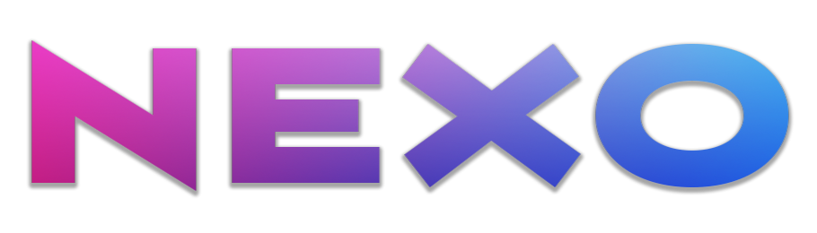

# NEXO - Conecte-se, colabore, conquiste.

> 🚀 **Aplicação disponível online:** [CLIQUE AQUI PARA ACESSAR O PROJETO](https://nexo-projeto-tcc.web.app/)

## 📖 Sobre o Projeto

O **NEXO** é uma plataforma web desenvolvida como Trabalho de Conclusão de Curso (TCC) em Ciência da Computação. O objetivo da aplicação é conectar estudantes universitários a projetos acadêmicos, facilitando a formação de grupos baseados em habilidades e interesses em comum.

A plataforma é uma alternativa para encontrar colegas com afinidade acadêmica, promovendo a colaboração e o networking dentro da universidade.

## ✨ Funcionalidades Principais

* **Autenticação:** Login e cadastro via E-mail/Senha com verificação de e-mail.
* **Sistema de Match:** Recomendação de projetos baseada em tags de habilidades e interesses.
* **Chat em Tempo Real:** Mensagens diretas e grupos de projeto instantâneos.
* **Gerenciamento de Projetos:** Criação, edição e exclusão de projetos.
* **Candidaturas:** Sistema de aplicar para vagas e gerenciamento de aprovação/rejeição pelo dono do projeto.
* **Perfil Completo:** Personalização de avatar, bio, links sociais (GitHub/LinkedIn).

## 🛠️ Tecnologias Utilizadas

O projeto foi desenvolvido utilizando as seguintes tecnologias modernas:

* **Prototipagem:** [Figma](https://www.figma.com/)
* **Frontend:** [React](https://reactjs.org/) (Vite)
* **Linguagem:** JavaScript (ES6+)
* **Estilização:** [Styled Components](https://styled-components.com/)
* **Backend & Banco de Dados:** [Firebase](https://firebase.google.com/) (Authentication, Firestore)
* **Deploy/Hospedagem:** Firebase Hosting

## 📄 Documentação do Projeto

### Prototipagem do nosso Projeto:
* **Link do Figma:** [Figma](https://www.figma.com/design/hy8ZBXRpvZSutcLDjUVqkH/PROJETO-TCC-OFICIAL?node-id=1-27&t=KjsJHcoseCuR5PmW-1)

### Regras do nosso Banco de Dados:
* **Link das Regras:** [Clique aqui para abrir o PDF](public/regrasFirestore.pdf)

## 👥 Autores

* **[Anthony Souza Arantes de Jesus]** - *Product Designer + Dev Fullstack* - [GitHub](https://github.com/Anthony-Arantes)
* **[Giovana Celestino Ramalho]** - *Product Designer + Dev Fullstack* - [GitHub](https://github.com/gi-celeste) | [LinkedIn](https://www.linkedin.com/in/giovana-celestino-ramalho/)
* **[Giovanna Freitas Silva]** - *Product Designer + Dev Fullstack* - [GitHub](https://github.com/gigifs) | [LinkedIn](http://linkedin.com/in/giovannafreitas-silva/)

---
Desenvolvido para o TCC de Ciência da Computação - 2025.
